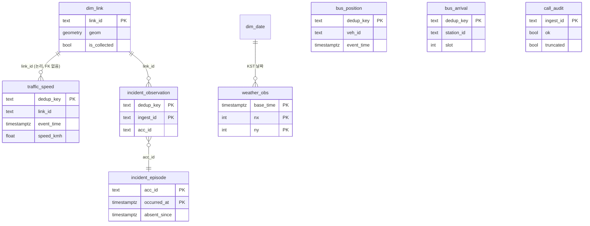

# Gold ERD (Step 6)

```mermaid
erDiagram
    dim_link ||--o{ traffic_speed : "link_id (논리, FK 없음)"
    dim_link ||--o{ incident_observation : "link_id"
    dim_date ||--o{ weather_obs : "KST 날짜"
    incident_observation }o--|| incident_episode : "acc_id"
    dim_link { text link_id PK  geometry geom  bool is_collected }
    traffic_speed { text dedup_key PK  text link_id  timestamptz event_time  float speed_kmh }
    bus_position { text dedup_key PK  text veh_id  timestamptz event_time }
    bus_arrival { text dedup_key PK  text station_id  int slot }
    incident_observation { text dedup_key PK  text ingest_id PK  text acc_id }
    incident_episode { text acc_id PK  timestamptz occurred_at PK  timestamptz absent_since }
    weather_obs { timestamptz base_time PK  int nx PK  int ny PK }
    call_audit { text ingest_id PK  bool ok  bool truncated }
```

FK 를 두지 않은 이유: 수집 링크 밖의 `link_id`(돌발)와 시드 전 적재 순서를 허용하기 위해서다. 정합성은 DQ(Step 8)에서 본다.
